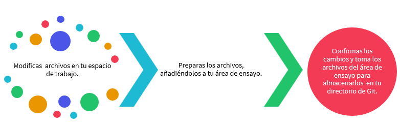

# Controlador de versiones

La generación de código es un que hacer bastante complicado, no solo por la dificultad de los algoritmos que debemos emplear en algunas soluciones o la complejidad de los los mismos,  sino porque también nos enfrentamos a la posibilidad de utilizar varias soluciones y debemos decidir cuál podría ser la mejor. En ese sentido, nuestro propio código se convierte en un laboratorio de pruebas y errores, que sin el cuidado adecuado puede destrozarse completamente solo cambiando la versión de un paquete o desconfigurando e inutilizando algún script o archivo vital en nuestro código. Desearemos muchas veces poder regresar el tiempo y gracias a los software de control de versiones de alguna manera lo podremos hacer.

Un sistema de control de versiones (VCS) es un software que ayuda a gestionar los diferentes cambios que se hacen sobre un código fuente. Aunque tenemos varias herramientas que permiten realizar esta tarea: Git, BitKeeper, CVS, SourceSafe, Subversion, entre otros; en este curso usaremos Git, diseñado por [Linus Torvalds](https://es.wikipedia.org/wiki/Linus_Torvalds) en 2005 con el fin de mantener aplicaciones con muchos archivos en su código fuente. Fue publicado bajo licencia de software libre  GPLv2 de GNU.
## Git 

***Tomado de: Wikipedia***

Más allá de tener un control de versiones, la idea fundamental detrás de Git es que, a pesar de que hay un repositorio central del proyecto, cada programador del equipo descarga una copia local (Sistema de control de versiones distribuido) permitiendo trabajar desde su propio dispositivo. Los cambios en el proyecto son fácilmente intercambiables entre los demás integrantes del proyecto y cuando la versión de ese archivo esté lista se puede subir al repositorio. Identificamos tres secciones principales de un trabajo en git:

El **repositorio *(directorio .git)*** es donde se almacenan los metadatos y la base de datos de objetos para tu proyecto. Es la parte más importante de Git, y es lo que se copia cuando clonas un repositorio desde otra computadora.

El **espacio de trabajo** es una copia de una versión del proyecto. Estos archivos se sacan de la base de datos comprimida en el directorio de Git, y se colocan en disco para que los puedas usar o modificar.

El **área de ensayo (área de preparación)** es un archivo, generalmente contenido en tu directorio de Git, que almacena información acerca de lo que va a ir en tu próxima confirmación. A veces se le denomina índice (“index”), pero se está convirtiendo en estándar el referirse a ella como el área de preparación.

El flujo de trabajo básico en Git es algo así:

Si una versión concreta de un archivo está en el directorio de Git, se considera confirmada (committed). Si ha sufrido cambios desde que se obtuvo del repositorio, pero ha sido añadida al área de preparación, está preparada (staged). Y si ha sufrido cambios desde que se obtuvo del repositorio, pero no se ha preparado, está modificada (modified).

En este caso, dicha separación de reconoce tres estados de los archivos:

* **Confirmado** *(Commited)*: Archivo y datos almacenados de manera segura en el la base de datos local. 
* **Modificado** *(modified)*: Archivo modificado pero no confirmado para subir a la base de datos. 
* **Preparado** *(staged)*: Se marca el archivo modificado en su versión actual para que vaya en la próxima confirmación.

Luego, el directorio de git que contiene las tres secciones principales vistas anterioremente permitirá el flujo de datos según lo siguinte:

## Instalación Git y uso con la línea de comandos

Trabajermos según el libro [Pro Git](https://git-scm.com/book/en/v2) utilizando la línea de comandos, así mismo le damos continuidad al primer capítulo de nuestro curso, si bien no hacemos un recorrido exhaustivo sobre la fortaleza de este software por lo menos trabajaremos en sus aspectos básicos. Iniciamos con la instalación, siguiendo la guía de este pequeño tutoríal: 

***
[Instalación de Git](https://git-scm.com/book/es/v2/Inicio---Sobre-el-Control-de-Versiones-Instalaci%C3%B3n-de-Git)
***

Para la instalación seleccionamos nuestro sistema operativo y en el link escogemos una versión adecuada y actualizada. Posterior a la instalación, hacemos una configuración desde la línea de comandos. Si ya fue instalado Anaconda podemos utilizar `Anaconda Prompt` para hacer la configuración. Se recomienda que cada vez que se instale alguno de estos programas se haga un reinicio del equipo con el fin de que el instalador haga todas los ajustes necesarios para su correcto uso.

## Github

Con [Github](https://github.com/) podremos mantener y administrar repositorios en la nube. Es una plataforma de colaboración en la que varios científicos de datos, desarrolladores, diseñadores, entre otros, trabajan sobre un mismo proyecto de forma controlada, sincrónica y organizada.

Es importante reconocer que Git es un controlador de versiones y GitHub es una plataforma web que incorpora características de Git.  De hecho, GitHub es el mayor proveedor de alojamiento de repositorios Git y muchos proyectos de código abierto lo utilizan para realizar su seguimiento de fallos, hacer revisiones de código y documentar sus proyectos. Constantemente trabajaremos con github y por lo tanto se recomienda que desde este momento se vaya creando una cuenta en esta plataforma.

Sus acciones principales y carcaterísticas de la plataforma que armonizan el trabajo de la comunidad con Git son:

* Fork: El proceso de copiar el código de un proyecto para hacer modificaciones.
* Pull: Puede compartir sus cambios al proyecto a través de una «solicitud pull».
* Fusión: Los propietarios pueden añadir nuevos cambios a sus proyectos a través de una fusión, y dar crédito a los contribuyentes que los han sugerido.

... una linda visión de trabajo en un gran equipo...

