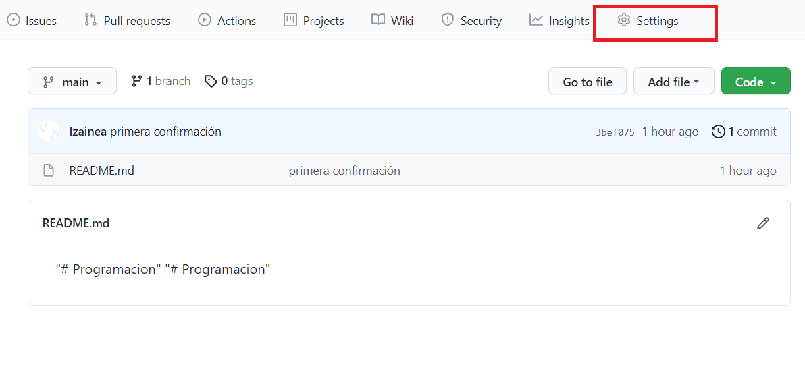
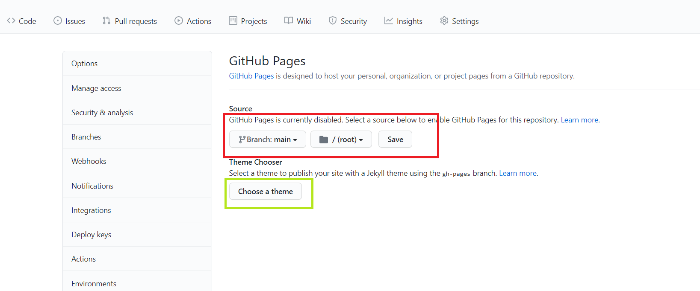
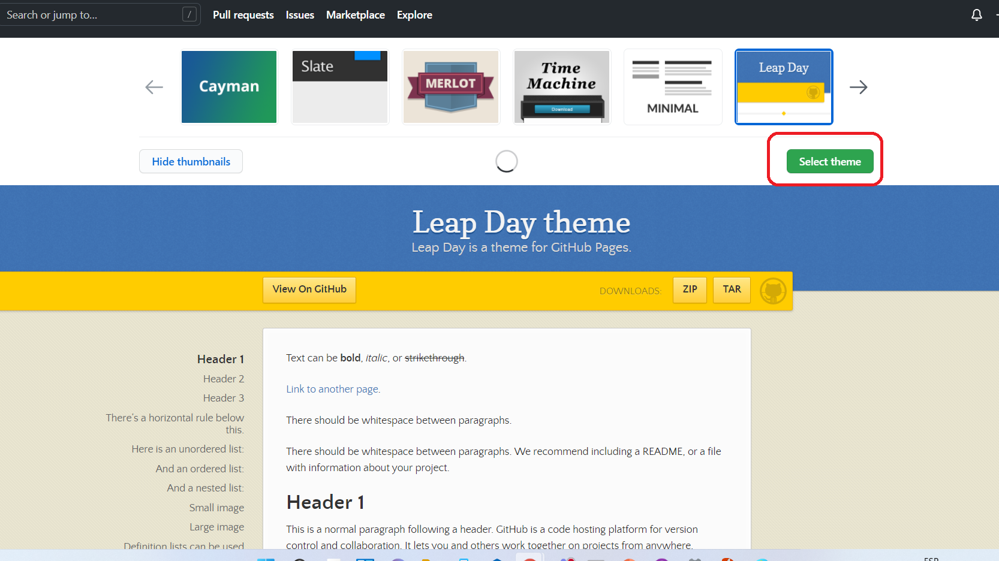
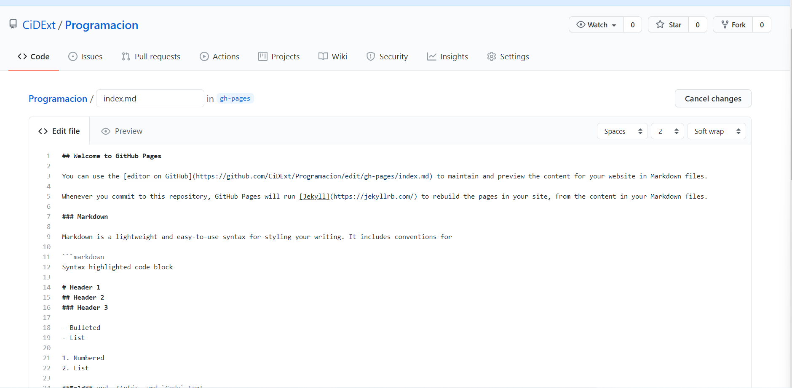
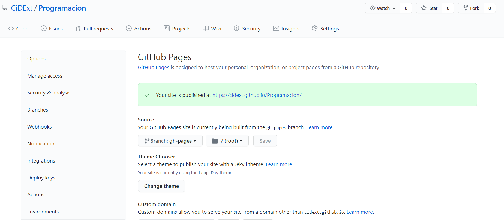
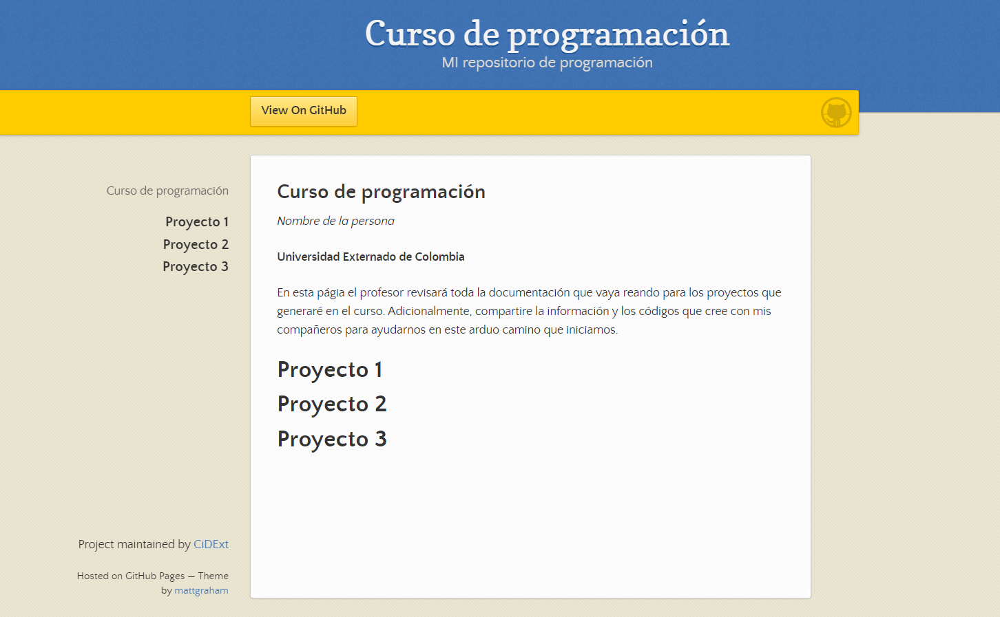

## Comandos básicos de git - Proyecto 1 - Mi primera página

A continuación hacemos una revisión de los comandos más elemenetales de git haciendo un recorrido por las diferentes secciones de Git e incluyendo una nueva zona que corresponde al repositorio en la nube (remoto).


En ese sentido, para aprender a integrar Git, Github y algunas de sus funciones más utilizadas, crearemos una página muy simple que contendrá toda la documentación de los proyectos que llevaremos a cabo en este curso. Para este ejercicio es neceario haber instalado Git, tener una cuenta en Github y configurar el usuario en el repositorio. 

Iniciaremos creando en nuestra cuenta un repositorio:

* **Paso 1**: En la parte superior derecha de la página de inicio de su cuenta de github haga clic en la tecla agregar:


Seleccione nuevo repositorio:


Ingrese los valores del formulario según la siguiente imagen:


Hagan clic en crear repositorio.

Aparecerá una página como la siguiente:


Usaremos el recuadro resaltado, en esas líneas de código hacemos varias cosas, explicaremos en detalle. Antes que nada usando el explorador de archivos de bash `cd`, `dir` y `mkdir` cree una carpeta vacía que alojará su repositorio:


Después de llegar a la carpeta deseada iniciamos los pasos propuestos por GitHub, deben ser cuidadosos en usar la opción HTTPS. Cada línea hace lo siguiente:


```
echo "# Programación" >> README.md
```

- Escribe la línea `# Programación` en el archivo *README.md*.


```
git init
```

- El comando `git init` crea un nuevo repositorio de Git. Se utiliza para convertir un proyecto existente y sin versiones en un repositorio de Git, o para empezar un nuevo repositorio vacío. En este caso crea el repositorio `.git` en nuestra carpeta con un solo archivo.


```
git add README.md
```

```
git add .
```

- El comando `git add`  envía el archivo `README.md` al área de ensayo. Es obligatorio antes de confirmar el archivo. `git add .` envía a todos los archivos cambiados al área de ensayo. En general tenemos estos comandos:


||New files|Modified files|Deleted files|Files with names beginning with a dot|Current directory|Higher directories|
|:--:|:--:|:--:|:--:|:--:|:--:|:--:|
|`git add -A`|Yes|Yes|Yes|Yes|Yes|Yes|
|`git add .`|Yes|Yes|Yes|Yes|Yes|No|
|`git add -u`|No|Yes|Yes|Yes|Yes|Yes|

```
git commit -m "first commit"
```

- El comando `git commit` crea una confirmación, que es como una instantánea de su repositorio.  [*"Debe realizar nuevas confirmaciones con frecuencia, basadas en unidades lógicas de cambio. Con el tiempo, las confirmaciones deben contar una historia de la historia de su repositorio y cómo llegó a ser como es actualmente."*](https://github.com/git-guides/git-commit)
    Incluyen muchos metadatos además del contenido y el mensaje, como el autor, la marca de tiempo y más. "Mi fisrt commit" representa el mensaje de esa confirmación. La coherencia de este ensaje permite una mejor revisión de las versiones del proyecto.
    

```
git branch -M main
```

- El comando `git branch` permite crear, administrar y borrar ramas. En este caso estamos creando la rama main y lo que vamos modificando se pega a esa rama.

```
git remote add origin https://github.com/<<Usuario>>/<<Repositorio>>.git
```

- El comando `git remote `  administra el conjunto de controles remotos que está rastreando con su repositorio local. En este caso `git remote add` agrega una conexión remota y `git remote add origin URL` hace referencia al nombre amigable de la URL que almacena el repositorio remoto. 

```
git git push -u origin main
```

Sube todos los archivos dentro del repositorio local al repositorio remoto. Posterior a la ejecucióin actualice su repositorio y verá lo siguiente:


El archivo Readme.MD subió al repositorio.

### Github Pages

Ahora en este repositorio crearemos una página. Vamos a la configuración del repositorio:



Luego opción Pages:


Ahora vamos a seleccionar la rama de Github fuente de la página. Paraeste primer ejercicio será nuestra rama principal. Luego Escogemos un tema que nos guste:



Seleccionamos el tema:



Aparece el códigoo fuente de la página. Es un archivo en Markdown. Confirmamos los cambios



Observen que GitHub creo una nueva rama. La usaremos más adelante. Vamos a acrualizar nuestro repositorio local, utilizamos `git pull`  que actualiza su rama de trabajo local actual y todas las ramas de seguimiento remoto. Es una buena idea ejecutar git pull con regularidad en las ramas en las que está trabajando localmente.

Sin git pull, (o el efecto de él), su repositorio local no tendría ninguna de las actualizaciones que están presentes en el control remoto.

```
git pull --all

```

Ahora trabajaremos en la otra rama para modificar la página. Cambiaremos la rama y la info de la carpeta., ejecutamos:


```
git switch -c gh-pages

```

Hemos creado una nueva rama de nuestro repositorio. Vamos a actualizarlo según la rama del repositorio remoto. Como su procedencia es distinta tenemos que forzar el cambio. Usamos lo siguiente:


```
git pull origin gh-pages --allow-unrelated-histories
```

Nuestra carpeta cambia:


Modifiquemos el archivo ```index.MD``` usando el bloc de notas. Que quede escrito algo como lo siguiente:


```Markdown

## Curso de programación

*Nombre de la persona*

**Universidad Externado de Colombia**

En esta págia el profesor revisará toda la documentación que vaya reando para los proyectos que generaré en el curso. 
Adicionalmente, compartire la información y los códigos que cree con mis compañeros para ayudarnos en este arduo camino que iniciamos.

# Proyecto 1
# Proyecto 2
# Proyecto 3

``` 
Actualice el proyecto remoto:
```
git add .
git commit -m 'Ejercicio1-Primera_pagina'
git push -u origin gh-pages

```

Observe que el cambio se ejecuto:


Vayan a ``Settings/Pages``



y visiten su página:

